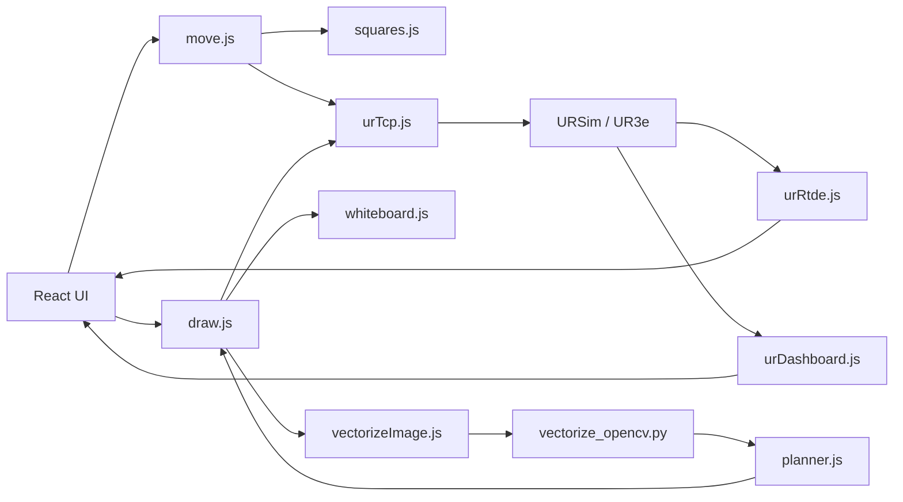

# UR3e Web Control Architecture

This document is meant for code review and project handoff. It can also be exported to PDF later if you want a static attachment.

## Main File Map

### Frontend
- `UI/src/App.tsx`
  - top-level state, API calls, mode switching
- `UI/src/components/AppHeader.tsx`
  - global mode/control/status header
- `UI/src/components/CommandControls.tsx`
  - chess, tic-tac-toe, and whiteboard command panels
- `UI/src/components/WorkspaceBoard.tsx`
  - board rendering and draw preview rendering
- `UI/src/components/RobotStatusSidebar.tsx`
  - connection, profile, ETA, and safety sidebar
- `UI/src/config/draw.ts`
  - preset draw tuning values
- `UI/src/types.ts`
  - shared frontend types

### Backend
- `backend/src/server.js`
  - backend entrypoint
- `backend/src/routes/move.js`
  - chess and tic-tac-toe routes
- `backend/src/routes/draw.js`
  - whiteboard preview/execute/stop routes
- `backend/src/routes/control.js`
  - dry-run and control-lock helpers

### Robot / Calibration
- `backend/src/robot/squares.js`
  - board calibration and square-to-pose mapping
- `backend/src/robot/whiteboard.js`
  - whiteboard frame mapping from normalized points to poses
- `backend/src/robot/urTcp.js`
  - URScript transport
- `backend/src/robot/urRtde.js`
  - live robot motion telemetry
- `backend/src/robot/urDashboard.js`
  - dashboard fallback status
- `backend/src/robot/state.js`
  - shared in-memory status and control lock

### Drawing Pipeline
- `backend/src/draw/vectorizeImage.js`
  - Node bridge into Python/OpenCV
- `backend/src/draw/vectorize_opencv.py`
  - image-to-contour vectorization
- `backend/src/draw/planner.js`
  - stroke cleanup, scaling, simplification

## Request Pipelines

### Chess / Tic-Tac-Toe
1. User clicks a square or cell in the UI.
2. `App.tsx` sends a move or mark request.
3. `move.js` converts that target into a calibrated pose.
4. `urTcp.js` sends the generated URScript.
5. `urRtde.js` updates the live moving/idle status.

### Whiteboard Drawing
1. User uploads a PNG/JPG image in the UI.
2. `App.tsx` sends the image and tuning values to `/api/draw/preview` or `/api/draw/execute`.
3. `draw.js` calls `vectorizeImage.js`.
4. `vectorizeImage.js` launches `vectorize_opencv.py`.
5. `vectorize_opencv.py` extracts contours and returns normalized strokes.
6. `planner.js` rescales and simplifies the strokes.
7. `draw.js` applies safety checks and builds URScript.
8. `whiteboard.js` maps normalized points into robot poses.
9. `urTcp.js` sends the script to URSim or the robot.

## Diagram

## Known Limitations
- Physical calibration still requires manual tuning.
- Draw quality depends heavily on clean, high-contrast inputs.
- ETA is an estimate based on path length and configured speeds; it is not a full motion simulator.
- Validation is still mostly simulator-based and manual.
